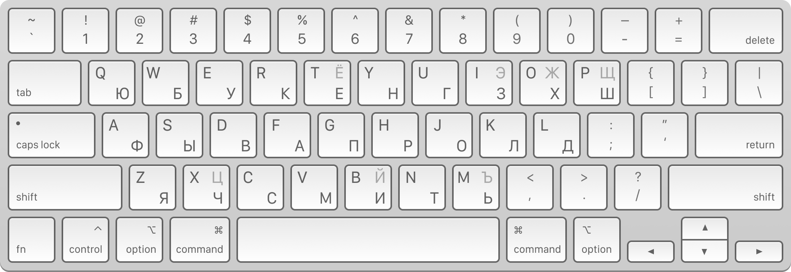
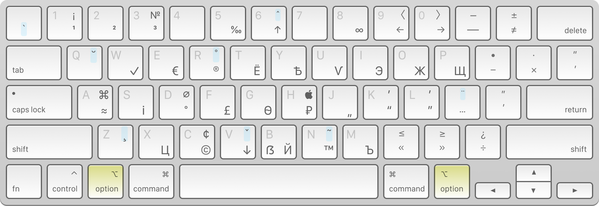

# Пунктуальная раскладка

Это русская раскладка, изменённая так, чтобы _все_ знаки препинания находились там же, где и в стандартной английской раскладке:

Однажды я наткнулся на [пост](https://tonsky.livejournal.com/318571.html) Никиты Прокопова о клавиатурных раскладках. Вот в чём проблема:

> Стандартная русская раскладка проектировалась по остаточному принципу исходя из условия, что латинскую менять нельзя. Это привело к тому, что в русской раскладке пунктуация (запятая, точка, двоеточие, точка с запятой, кавычка, вопрос) расположена на других местах, нежели в английской. Это очень путает, если вы регулярно пользуетесь обеими. А кое-что в русской раскладке и вовсе нельзя набрать, например, одинарную кавычку.

Мне понравилась идея передвинуть редко используемые буквы на альт-слой, но захотелось пойти ещё дальше — оставить всю пунктуацию на своих стандартных местах, ещё сильнее перекроив русскую раскладку.

Получился «ЮБУКЕН».

По итогам двух лет использования могу сказать, что вышло весьма удобно. Переучиться было не так сложно, как казалось на первый взгляд. Буквы, оказавшиеся на втором слое — самые редко встречающиеся в тексте, так что преимущества от удобного расположения знаков препинания перевешивают.

В бандле две раскладки, английская и русская. Английская отличается от стандартной лишь дополнительными символами из Типографской раскладки.

### Особенности

- В обеих раскладках пунктуация на стандартных для английской раскладки местах.
- Перенесены на альт-слой буквы Ё, Э, Ж, Щ, Ц, Й, Ъ.
- Буквы Ю, Б, З, Х, Ш находятся не на своих обычных местах.
- В отличии от раскладки Никиты Прокопова, цифры и символы на кнопках с цифрами — без «машинописи».

Как и во многих кастомных раскладках, добавлены типографские символы из раскладки Ильи Бирмана (положение некоторых символов также изменено для сосуществования с русскими буквами на альт-слое).

### Ссылки

- [Универсальная раскладка](https://github.com/tonsky/Universal-Layout) Никиты Прокопова
- [Универсальная раскладка](https://github.com/a13/xkb-custom) a13
- [Типографская раскладка](https://ilyabirman.ru/projects/typography-layout) Ильи Бирмана
- [Ukelele.app](http://scripts.sil.org/ukelele) для модификации раскладки под свои нужды